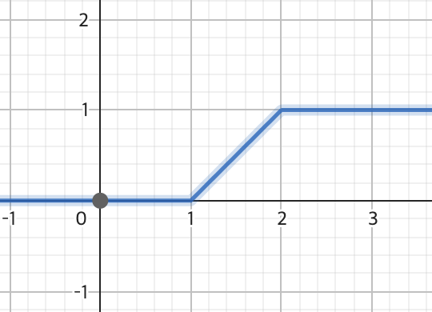

## clone toss & daangn recruit page by framer-motion 

The code written now is a collection of **bad practices**. 

How can someone be good from the start? 

I have no doubt that I can write better code in the near future.


### demo
https://scroll-motion.vercel.app/

### logics

**scroll**

I put the `scrollY` value as the `x` value, and set the corresponding `y` value as a `CSS attribute`.

`scrollY`값을 x값으로 넣고, 그것에 대응되는 `y`값을 `CSS attribute`로 넣어주는 방식으로 구현했다.

|name|args|figure|
|--|--|-|
|quadraticFunction|`s1`, `s2`, `a`|`s1`=`1`, `s2`=`3`, `a`=`-1` |
|pieceNormalizeFunction|`l`, `r`, `increase`|`l`=`1`, `r`=`2`, `increase`=`false` |

```tsx
import { motion, useScroll, useTransform } from 'framer-motion';
...
const Y_RATIO = 10;

function App() {
  const { scrollYProgress } = useScroll();
  ...

  const opacity = useTransform(scrollYProgress, (value) =>
    pieceNormalizeFunction(1, 2)(value * Y_RATIO)
  );
  ...
  return <>
   <motion.div style={{ ..., opacity }}>...</motion.div>
  </>
}
```

Considering the scroll value in the range of 0~10 (`Y_RATIO`),

- Before it becomes 1, the value is always 0,
- In the 1~2 range, the value increases from 0 to 1,
- After 2, the value is always 1.

The issue with this approach is that even when the value is constant, it still has to go through a function. I'd like to improve this if possible.

위 코드에서 스크롤 값이 0~10(`Y_RATIO`) 범위라고 생각했을 때 opacity 값은 아래와 같다.
- 1이 되기 전에는 항상 0, 
- 1~2 구간에서는 0->1로 값이 증가, 
- 2 이후로는 항상 1

이 방식의 문제는, 항상 값이 같을 때에도 함수를 거쳐야 한다는 점이다.
개선할 수 있으면 좋겠다~
